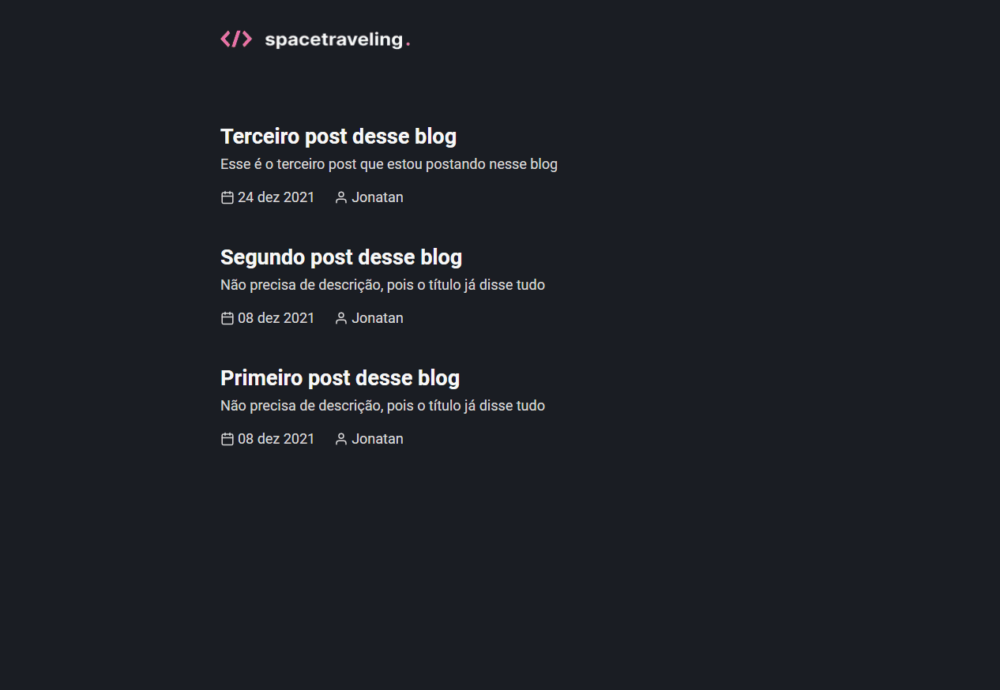

<h1 align="center">
  Spacetraveling
</h1>

Este desafio consiste em criar um blog do zero

## 👀 Funcionalidades Principais
- [x] Listar todas as publicações
- [x] Visualizar uma publicação

## 📦 Funcionalidades Extras
- [x] Preview do post
- [x] Navegação entre os posts
- [x] Comentários
- [x] Data da última alteração

## 🔧 Ferramentas Utilizadas
- NextJS
- Prismic CMS
- React Icons
- date-fns
- utterances

## 💻 Aplicação

## 🌠 Extras
Para mais detalhes sobre o desafio, acesse [esse link](https://www.notion.so/Desafio-01-Criando-um-projeto-do-zero-b1a3645d286b4eec93f5f1f5476d0ff7).

Para mais detalhes sobre as funcionalidades extras, acesse [esse link](https://www.notion.so/Desafio-02-Adicionando-features-ao-blog-d466866c02544c79bbada9717c033d0a).